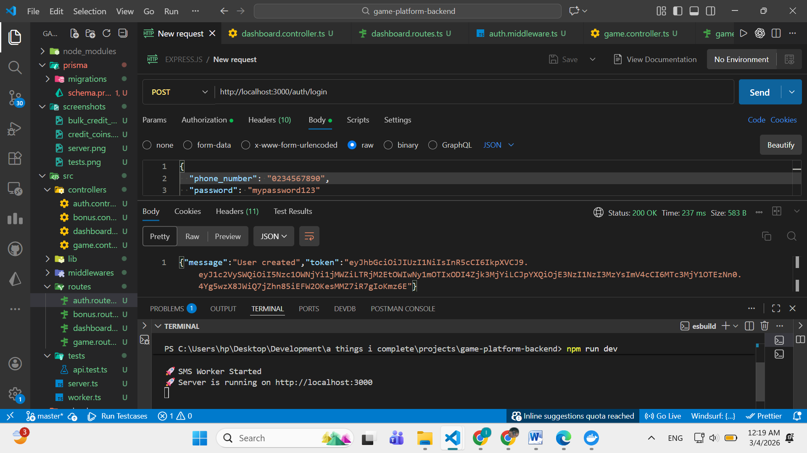
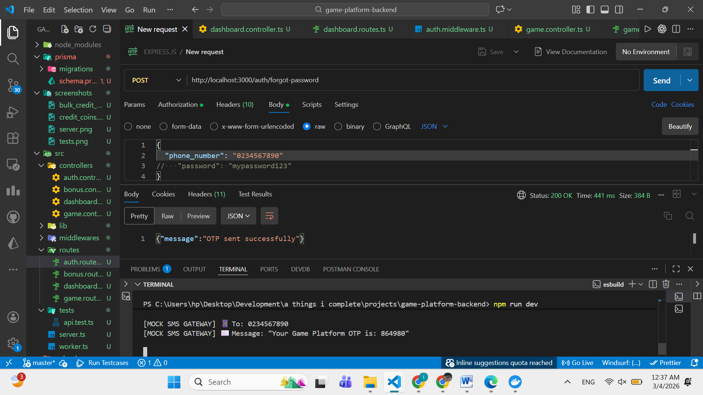
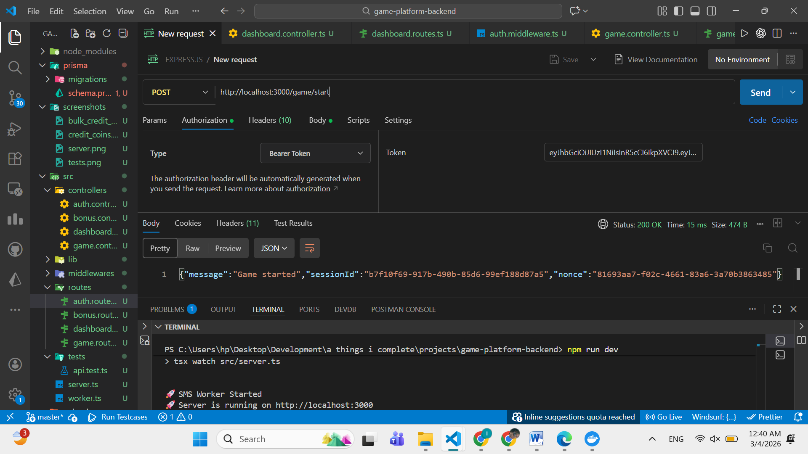
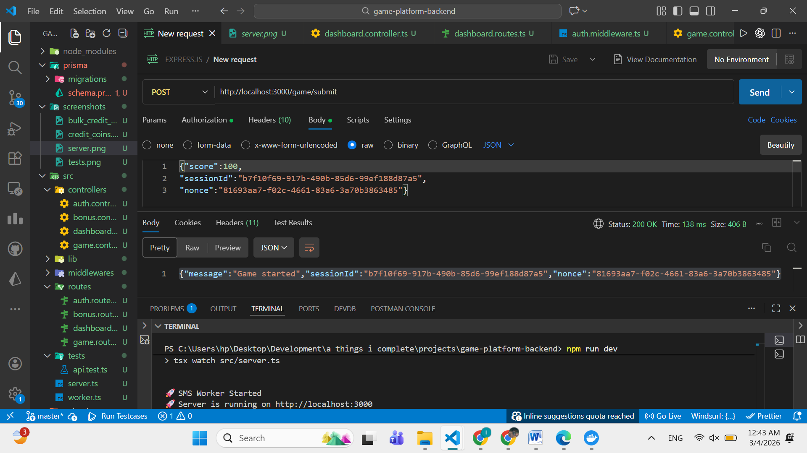
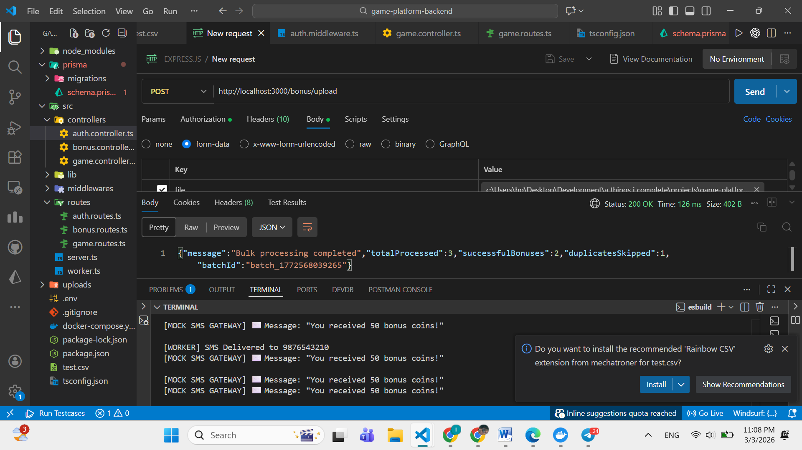
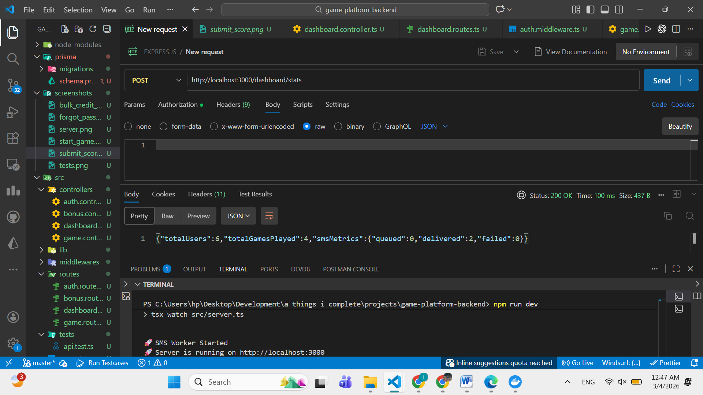
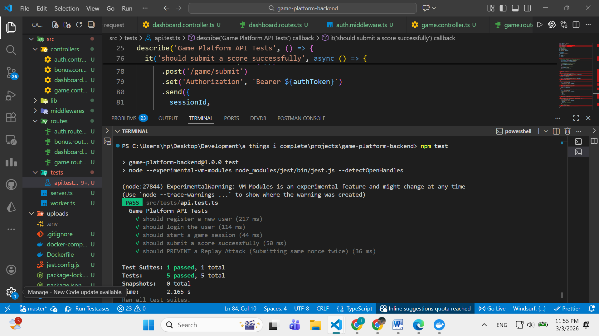

# High-Throughput Game Platform Backend

A scalable backend service built with Node.js, Express, PostgreSQL, and Redis. Features include secure authentication, replay attack prevention, and high-performance bulk processing.

## 🚀 Features

- **User Management**: Secure JWT Authentication & OTP-based Password Reset.
- **Game Mechanics**: Replay Attack Prevention using Nonces and Session Tracking.
- **High Throughput**: 
  - Uses **Node.js Streams** to parse large CSV files (50,000+ records) without memory crashes.
  - Uses **Prisma Transactions** to ensure data integrity.
  - Uses **BullMQ (Redis)** to offload SMS sending to a background worker.
- **SMS System**: 
  - Mock SMS Provider simulating network latency and failure rates.
  - Status tracking (Queued -> Delivered/Failed).

## 🛠️ Tech Stack

- **Runtime**: Node.js (TypeScript)
- **Framework**: Express.js
- **Database**: PostgreSQL (Prisma ORM)
- **Queue**: BullMQ & Redis
- **Containerization**: Docker & Docker Compose

## 📦 Setup & Installation

1. **Clone the repository**
   ```bash
   git clone <repo-url>
   cd game-platform-backend
   ```


2. **Start Infrastructure**(PostgreSQL & Redis)
```
docker-compose up -d
```
3. **Install Dependencies**
npm install
4. **Setup Database**
```
npx prisma migrate dev --name init
```
4. **Run the Server**
```
npm run dev
```
**🧪 API Endpoints**
**Auth**
POST /auth/register - Create account
POST /auth/login - Get JWT Token
POST /auth/forgot-password - Request OTP
POST /auth/reset-password - Reset with OTP




**Game**
POST /game/start - Get Session ID & Nonce
POST /game/submit - Submit Score (Protected against Replay Attacks)





**Bonus System**
POST /bonus/upload - Upload CSV for bulk coin distribution.
Format: CSV file with header phone_number.


**Dashboard**
POST /dashboard/stats - View system metrics.


**Tests**

